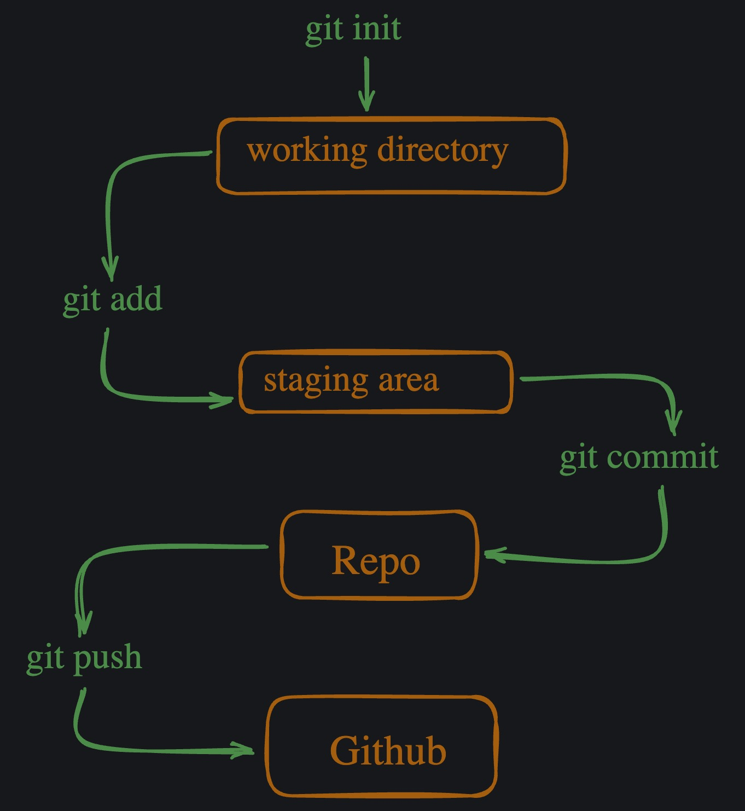
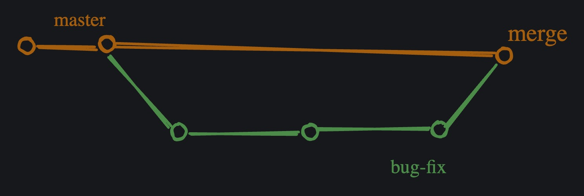
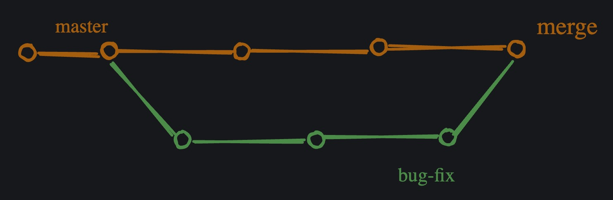
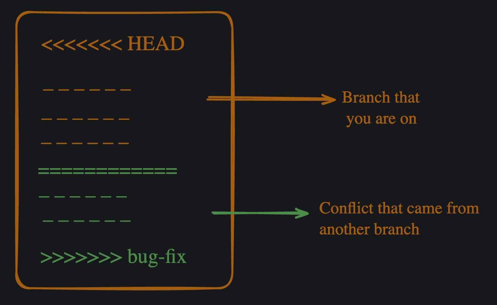
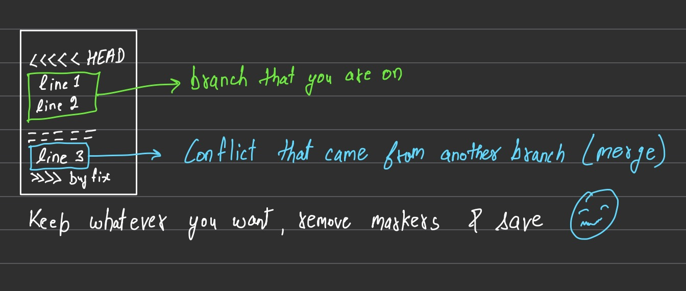
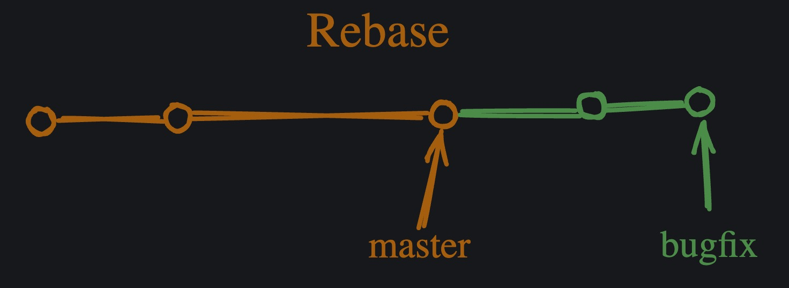
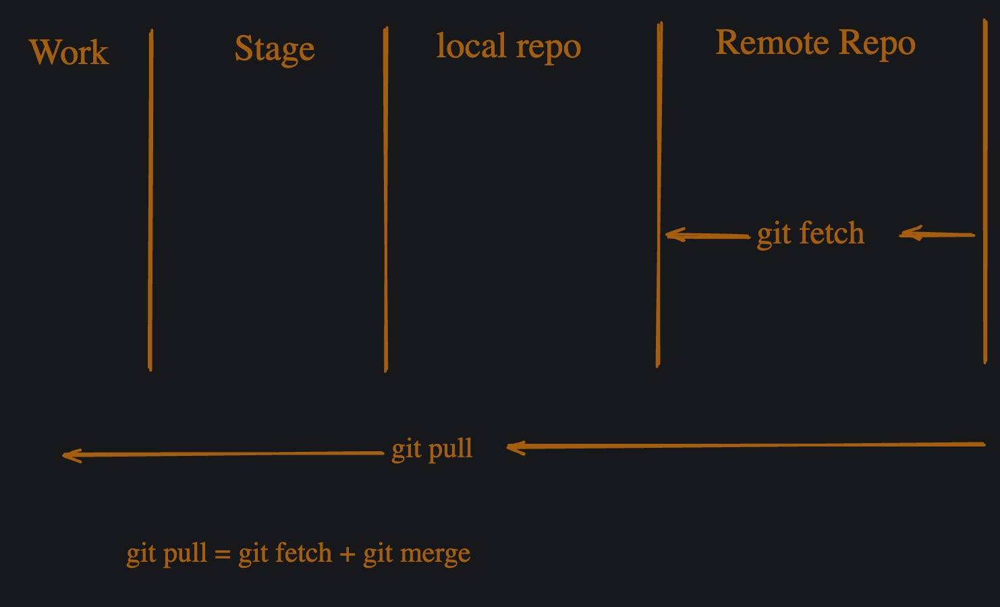

# Git Cheatsheet


### Git
- Version control 
- Free & open-source software
- Allows you to track changes to your files & folders and collaborate with others


### Version control systems 
- Used to manage the history of your code
- Allows you to track changes to your files and to collaborate with others
- Essential for software development
- Consider version control as a checkpoint in game. You can move to any time in the game and you can always go back to the previous checkpoint. This is the same concept in software development.

---

```bash
git --version
pwd
ls
ls -la      #shows that we've got a hidden .git folder as we initialize git

cd <folder_name>
cd ..       # takes you one folder back
```

### Repository
- Collection of files and directories that are stored together. 
- It's like a folder on your computer, but it is more than just a folder. It can contain other files, folders, and even other repositories. 
- You can think of a repository as a container that holds all your code.

---

### Your config settings

```bash
git config --global user.email "your-email@example.com"
git config --global user.name "Your Name"
```

#### To check your config settings:
```bash
git config --list
```

---

### Work flow
Write -> Add to staging area -> Commit to Repo -> Push to Github




## Creating a Repo

#### Stage
```bash
git status
git init      (initialise git)
git add <file1_name> <file2_name>     (enter selected files to staging area)
  OR
git add .     (enter all files to staging area)
git status 
```

#### Commit
```bash
git commit -m "commit message"
git status
```

#### Logs
```bash
git log
git log --oneline
```

#### Push
```bash
git remote -v
git remote add origin <HTTPS of Repo>
git remote -v 
git branch -M main
git push -u origin main
git push
```

---

### Commit message guidelines
- You can use either Present or Past Tense
- Industry practice -> use Present tense
- Eg: Add footer ✅  
      Added footer ❌


### Change default code editor for Git
- Cmd + Shift + P
- Type command: install 'code' command in PATH: git config --global core.editor "code --wait"


### .gitignore 
- For files you dont want to track like Node modules, API key, Secret
- Type file names in gitignore to ignore them
- Eg: .env, filename.jpg etc


### .gitkeep
If we want to keep some folders like images, logs etc but we dont have content to add to them, we add a .gitkeep file to them so that git tracks them


## Git Branches
- Used for working on diff versions of a project at the same time 
- Useful in collaborating on a project


#### HEAD
- It's a pointer to the current branch that you are working on. 
- Points to the latest commit in the current branch. 
- When you create a new branch, it's automatically set as the HEAD of that branch.


#### Creating a new branch

```bash
git branch                      # List all branches
git branch <branch_name>        # Create a new branch
git switch <branch_name>        # Switch to the given branch
git branch
git log                         # Show commit history
git switch main                 # Switch to the main branch
git switch -c <branch_name>     # Create and switch to a new branch
git restore <file_name>         # Restore a file to last committed state
```

NOTE: Commit before switching to a branch

---

#### Rename Branch
```bash
git branch -m <old_branch_name> <new_branch_name>
```


#### Delete Branch
```bash
git branch -d <branch_name>
```

#### Switch to a Branch
```bash
git checkout <branch_name>
```


#### List all Branches
```bash
git branch
```


---

#### Merging Branches 

```bash 
git switch main
git merge <file_name>
```

##### 1. Fast-forward merge


- Branch that you are trying to merge is usually ahead and there are no conflicts. 
- Fast-forward merge means that the commits in the bug-fix branch are directly merged into the main branch. 
- This can be useful when you want to merge a branch that has already been pushed to the remote repository.


##### 2. Not Fast-forward merge


- In this type of merge, the master branch also worked and have some commits that are not in the bug-fix branch.


##### Difference btw Fast-forward & Not Fast-forward Merge

- The difference lies in resolving the conflicts. 
- In a fast-forward merge, there are no conflicts. But in a not fast-forward merge, there are conflicts, and there are no shortcuts to resolve them. 
- You have to manually resolve the conflicts. Decide, what to keep and what to discard. VSCode has a built-in merge tool that can help you resolve the conflicts.



---

### Managing Conflicts 

You have to manually resolve the conflicts. Decide, what to keep and what to discard. VSCode has a built-in merge tool that can help you resolve the conflicts. I personally use VSCode merge tool. Github also has a merge tool that can help you resolve the conflicts but most of the time I handle them in VSCode and it gives me all the options to resolve the conflicts.

```bash     
git merge --abort
git merge <branch_name>
```



```bash
git status
git add <file_name>
git commit -m "commit message"
git status
```

---

### Git Diff
- Informative command 
- Shows the differences between two commits. It's used to compare the changes made in one commit with the changes made in another commit. 
- Git consider the changed versions of same file as two different files. Then it gives names to these two files and shows the differences between them.


#### How to read the diff
```
a -> file A and b -> file B
---- indicates the file A
+++ indicates the file B
@@ indicates the line number
```


Here the file A and file B are the same file but different versions.

Git will show you the changes made in the file A and file B. It will also show you the line number where the change occurred along with little preview of the change.


#### Comparing Working Directory and Staging Area:
```bash
git diff
```

This command shows the unstaged changes in your working directory compared to the staging area. This command alone will not show you the changes made in the file A and file B, you need to provide options to show the changes.


#### Comparing Staging Area with Repository:
```bash
git diff --staged
```

This command shows the changes between your last commit and the staging area (i.e., changes that are staged and ready to be committed).


#### Comparing between branches:
```bash
git diff <branch-name-one> <branch-name-two>
OR
git diff branch-name-one..branch-name-two       # Better
```

Eg: git diff 5a2c697..0cd1c33   
(found using git log --oneline)


#### Comparing Specific Commits:
```bash
git diff <commit-hash-one> <commit-hash-two>
```

---

### Git Stash 

- Stash is a way to save your changes in a temporary location. 
- Useful when you want to make changes to a file but don’t want to commit them yet. 
- You can then come back to the file later and apply the changes.


❗ Conflicting changes will not allow you to switch branches without committing the changes. 
Use git stash command to save your changes in a temporary location.


```bash
git stash
```

Naming the stash
```bash
git stash save "work in progress on X feature"
```

View the stash list
```bash
git stash list
```

Apply the stash
```bash
git stash apply
```

Apply the specific stash
```bash
git stash apply stash@{0}
```
Here stash@{0} is the name of the stash. You can use the git stash list command to get the name of the stash.

Applying and dropping the stash
```bash
git stash pop
```

Drop the stash
```bash
git stash drop
```

Applying stash to a specific branch
```bash
git stash apply stash@{0} <branch-name>
```

Clearing the stash
```bash
git stash clear
```

---

### Git Tag

- Mark a specific point in your repository.
- Useful when you want to remember a specific version of your code or when you want to refer to a specific commit
- Tags are like sticky notes that you can attach to your commits.

```bash
git tag <tag-name>
```

#### Create an annotated tag
```bash
git tag -a <tag-name> -m "Release 1.0"
```

#### List all tags
```bash
git tag
```

#### Tagging a specific com
```bash
git tag <tag-name> <commit-hash>
```

#### Push tags to remote repository
```bash
git push origin <tag-name>
```

#### Delete a tag
```bash
git tag -d <tag-name>
```

#### Delete tag on remote repository
```bash
git push origin :<tag-name>
```

---

### Git Rebase

- Git rebase is a powerful Git feature used to change the base of a branch. 
- It effectively allows you to move a branch to a new starting point, usually a different commit, by “replaying” the commits from the original base onto the new base. This can be useful for keeping a cleaner, linear project history.
- Some people like to use rebase over the merge command because it allows you to keep the commit history cleaner and easier to understand. 
- It also allows you to make changes to the code without affecting the original branch.

##### Merge commits
- Combines two or more commits into one. 
- It's created when you merge two or more branches into a single branch. 
- The merge commit contains all the changes from the original branches, and it is used to keep the project history clean and easy to understand.





Here’s a flow example of using git rebase with all the commands involved:

Suppose you have a feature branch called feature-branch that you want to rebase onto the main branch.

Ensure you are on the branch you want to rebase:
```bash
git checkout feature-branch
git rebase main
```
This will replay the commits from feature-branch on top of the latest changes in main.

##### Resolve any conflicts:
```bash
git add <resolved-files>
git rebase --continue
```

❗ Try to avoid —force option when using rebase. It can cause issues with the project history. I have seen many horror stories of people using —force to fix conflicts.

---  


### Git Reflog

- Shows you the history of your commits. 
- Allows you to see the changes that you have made to your repository over time. 
- Useful for debugging and understanding the history of your project.


View the reflog:
```bash
git reflog
```

Find specific commit:
```bash
git reflog <commit-hash>
```

Recover lost commits or changes
If you accidentally deleted a branch or made changes that are no longer visible in the commit history, you can often recover them using the reflog. First, find the reference to the commit where the branch or changes existed, and then reset your branch to that reference.
```bash
git reflog <commit-hash>
git reset --hard <commit-hash>
```

or you can use HEAD@{n} to reset to the nth commit before the one you want to reset to.
```bash
git reflog <commit-hash>
git reset --hard HEAD@{1}
```

---

## Github

- Web-based Git repository hosting service. 
- Popular platform for developers to collaborate on projects and to share code. 
- Provides a user-friendly interface for managing & tracking changes to your code, as well as a platform for hosting and sharing your projects with others.

Alternatives to Github are:
- Gitlab
- Bitbucket
- Azure Repos
- Gitea


### Configure your config file
```bash
git config --global user.email "your-email@example.com"
git config --global user.name "Your Name"
```
This will set your email and name as your global settings. You can change these settings later by running the following command:

```bash
git config --global user.email "your-email@example.com"
git config --global user.name "Your Name"
```

Now you can check your config settings:
```bash
git config --list
```

### Setup ssh key and add to github
If you haven’t done it already, you need to setup ssh key and add it to your github account. 

#### Step 1: Generate a new SSH key
To generate a new SSH key, open the terminal and run the following command:

```bash
ssh-keygen -t ed25519 -C "your-email@chaicode.com"
```

Here ed25519 is the type of key that you are generating. This creates a new SSH key, using the provided email as label.

#### Save the key

Enter a file in which to save the key (/Users/YOU/.ssh/id_ALGORITHM): [Press enter]

At the prompt you can enter passphrase for the key or you can leave it blank. If you leave it blank, the key will be saved without a passphrase.


#### Add key to your ssh-agent
After saving the key, you need to add it to your ssh-agent. You can do this by running the following command:

Here it is best to refer above link for more information, as Github has a lot of information on this. There is no point in repeating it here.


#### Add key to github
Use the webui to add the key to your github account. You can do this by following the instructions on the Github website.


### Adding code to remote repository
Now that you have setup your ssh key and added it to your github account, you can start pushing your code to the remote repository.

```bash
git init
git add <files>
git commit -m "commit message"
```

### Check remote url setting
You can check the remote url setting by running the following command:

```bash
git remote -v
```
This will show you the remote url of your repository.


### Add remote repository
You can add a remote repository by running the following command:

```bash
git remote add origin <remote-url>
```
Here <remote-url> is the url of the remote repository that you want to add and origin is the name of the remote repository. This origin is used to refer to the remote repository in the future.

```bash
git remote add origin https://github.com/hiteshchoudhary/chai-something.git
```

### Push code to remote repository
```bash
git push remote-name branch-name
```
Here remote-name is the name of the remote repository that you want to push to and branch-name is the name of the branch that you want to push.

```bash
git push origin main
```

### Setup an upstream remote
- Useful when you want to keep your local repository up to date with the remote repository. 
- Allows you to fetch and merge changes from the remote repository into your local repository.

```bash
git remote add -u <remote-url>
```
You can do this at the time of pushing your code to the remote repository.


```bash
git push -u origin main
```
This will set up an upstream remote and push your code to the remote repository.

This will allow you to run future commands like git pull and git push without specifying the remote name.

### Get code from remote repository
There are two ways to get code from a remote repository:

1. Fetch the code
Means that you are going to download the code from the remote repository to your local repository. 

2. Pull the code
Means that you are going to download the code from the remote repository and merge it with your local repository.




#### Fetch code
```bash
git fetch <remote-name>
```
Here **remote-name** is the name of the remote repository that you want to fetch from.

Pull code
```bash
# git pull <remote-name> <branch-name>
git pull origin main
```

Here **remote-name** is the name of the remote repository that you want to pull from and <branch-name> is the name of the branch that you want to pull.

